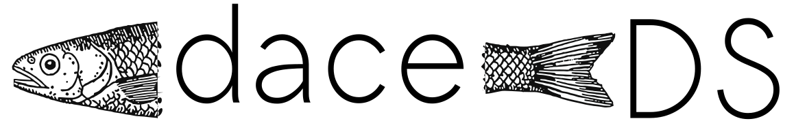

  

# 
daceDS is a **da**ta-**ce**ntric **D**istributed **S**imulation framework that focuses on data and loose couplings between components. 
It provides a simulation service with a web frontend that enables to combine various black-boxes in a plug-and-play manner. The connection of simulators, the integrating of data sources, the provision of data & interaction interfaces for external components, as well as the orchestration of simulation runs is covered. All communication is realized via a topic-based publish/subscribe paradigm on top of Apache Kafka. 

Under the term daceDS, this repo provides a prototypical implementation of the developed ideas in my upcoming PhD thesis. The implementations were used to asses the feasibility of the proposed concepts and to evaluate use cases and performance. Therefore, all warranties are expressly excluded. Feel free to use, fix bugs, contribute, or fork the codebase. 

  

## Features
- Data-centric coupling approach powered by stereotypical datamodels 
- Pub/Sub communication
- Loose couplings
- Accessible interfaces
- Sychronization mechanism

## Structure
This repository holds various subparts:
- The simulation service backend and some related utilities
- The simulation service web frontend
- Exemplary wrappers for traffic/mobility simulations
  -   PTV Visum
  -   MATSim
  -   SUMO
  -   CARLA
- An examplary wrapper for simulating wireless communication: 
  - OMNeT++ with the Veins IEEE 802.11p models
- Base wrappers that can be used to craft wrappers for additional simulators:
  - C++
  - Java
  - Python

## Literature
Main conceptual ideas can be found in the following publications:
- *M. Gütlein and A. Djanatliev, "On-demand Simulation of Future Mobility Based on Apache Kafka," in Simulation and Modeling Methodologies, Technologies and Applications, ser. Lecture Notes in Networks and Systems, M. S. OBAIDAT, T. OREN, and F. D. RANGO, Eds. Cham: Springer International Publishing, 2022, pp. 18–41.*
- *M. Gütlein, R. German , and A. Djanatliev, "Hide Your Model! Layer Abstractions for Data-Driven Co-Simulations," in 2021 Winter Simulation
Conference (WSC). IEEE, Dec. 2021, pp. 1–12.*
- *M. Gütlein, W. Baron, C. Renner, and A. Djanatliev, ``Performance Evaluation of HLA RTI Implementations," in 2020 IEEE/ACM 24th International Symposium on Distributed Simulation and Real Time Applications (DS-RT). IEEE, Sep. 2020, pp. 1–8.*
- *M. Gütlein and A. Djanatliev, "Modeling and Simulation as a Service using Apache Kafka:," in Proceedings of the 10th International Conference on Simulation and Modeling Methodologies, Technologies and Applications. SCITEPRESS - Science and Technology Publications, 2020, pp. 171–180.*
- *M. Gütlein and A. Djanatliev , "Coupled Traffic Simulation by Detached Translation Federates: An HLA-Based Approach," in 2019 Winter Simulation Conference (WSC). National Harbor, MD, USA: IEEE, Dec. 2019, pp. 1378–1389.*
- *M. Gütlein, R. German , and A. Djanatliev , "Towards a Hybrid Co-simulation Framework: HLA-Based Coupling of MATSim and SUMO," in 2018 IEEE/ACM 22nd International Symposium on Distributed Simulation and Real Time Applications (DS-RT).IEEE, 2018, pp. 1–9.*

